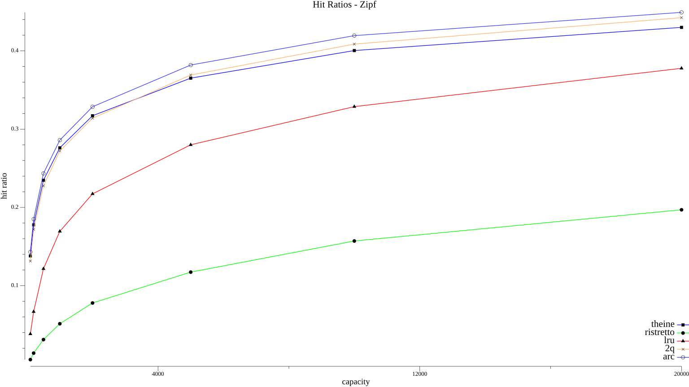
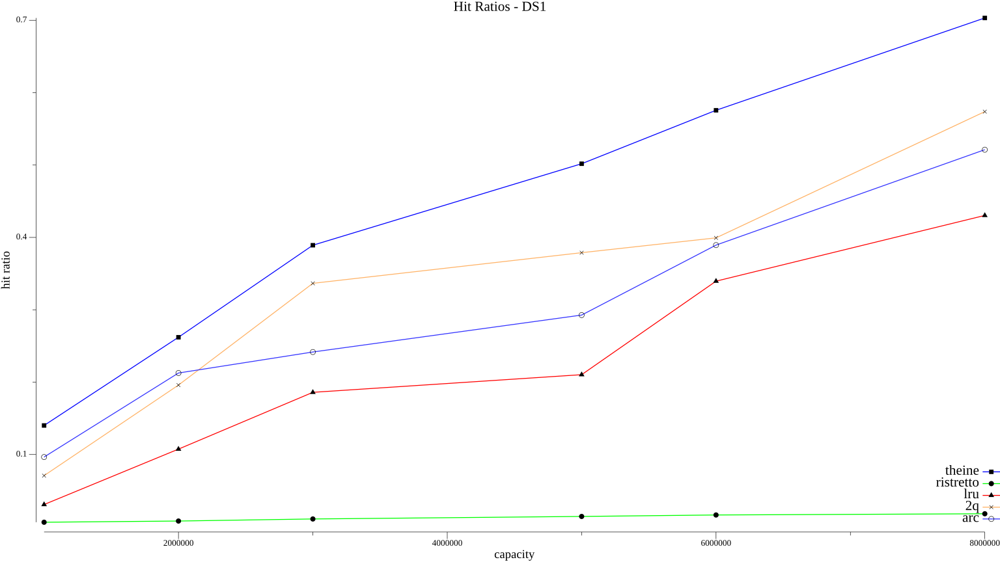
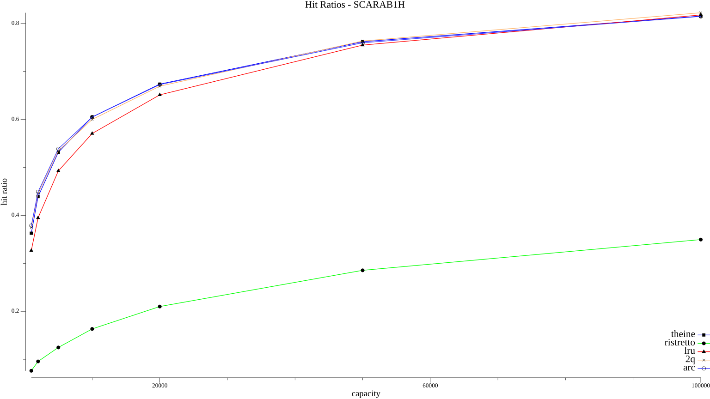

# Cache comparison benchmark for Go

This benchmark compares throughput and hit ratios of different cache packages. The benchmark is original used in [Theine](https://github.com/Yiling-J/theine-go).

Feel free to create PR if you want to include your cache package, or open issue/discussion if you have question/requirement.


## throughput

Throughput benchmark uses Go parallel benchmark, you can run it with:
```
make bench-throughput
```

Or

```
go test -bench=. -run=^$ -benchmem
```


## hit ratios

hit ratio benchmarks use several widely adopted trace files:

| Name     | Source                                           |
|----------|--------------------------------------------------|
| DS1      | Authors of the ARC algorithm                     |
| S3       | Authors of the ARC algorithm                     |
| SCARAB1H | https://github.com/ben-manes/caffeine/issues/106 |
| META     | cachelib shared Meta [trace](https://cachelib.org/docs/Cache_Library_User_Guides/Cachebench_FB_HW_eval/#running-cachebench-with-the-trace-workload)                       |

> The Meta trace file is too larger(> 1gb even gzipped), please download it from the link and put it in trace directory.

you can run it with:

```
make bench-ratios
```

You will see progress indicator(each dot represents 100k requests) when benchmark is running, result plots will be **generated automatically** in *results* directory after bench done.

Bench results will be cached in *results* directory with name: `{client name}-{bench name}.data`, this can make benchmark much faster when you are testing your package and run benchmark frequently. Just delete the file if you want to invalid cache.

## throughput result
```
goos: darwin
goarch: amd64
pkg: github.com/Yiling-J/go-cache-benchmark-plus
cpu: Intel(R) Core(TM) i7-9750H CPU @ 2.60GHz
BenchmarkGetParallel/theine-12          27966540                38.26 ns/op            0 B/op          0 allocs/op
BenchmarkGetParallel/ristretto-12       56940325                21.89 ns/op           17 B/op          1 allocs/op
BenchmarkSetParallel/theine-12          15530439               105.1 ns/op             0 B/op          0 allocs/op
BenchmarkSetParallel/ristretto-12       16919698                65.57 ns/op          115 B/op          3 allocs/op
BenchmarkZipfParallel/theine-12         15119775                77.76 ns/op            0 B/op          0 allocs/op
BenchmarkZipfParallel/ristretto-12      18971556                79.72 ns/op          100 B/op          3 allocs/op
```

## hit ratios result

**zipf**


**search**

This trace is described as "disk read accesses initiated by a large commercial search engine in response to various web search requests."


**database**

This trace is described as "a database server running at a commercial site running an ERP application on top of a commercial database."


**Scarabresearch database trace**

Scarabresearch 1 hour database trace from this [issue](https://github.com/ben-manes/caffeine/issues/106)


**Meta anonymized trace**

Meta shared anonymized trace captured from large scale production cache services, from [cachelib](https://cachelib.org/docs/Cache_Library_User_Guides/Cachebench_FB_HW_eval/#running-cachebench-with-the-trace-workload)


## add your cache package
First thing you need to do is wrapping your package to match `Client` interface:
```Go
type Style struct {
	Color color.Color
	Shape draw.GlyphDrawer
}

type Client[K comparable, V any] interface {
	Init(cap int)
	Get(key K) (V, bool)
	Set(key K, value V)
	Name() string
	Style() *Style
	Close()
}
```
Style is used to plot hit ratio results. if you only want throughput results, you can leave it empty. You can find more examples in *clients* directory.

Then you can add your client to either [throughput](https://github.com/Yiling-J/go-cache-benchmark-plus/blob/main/benchmark_test.go) or [hit ratio](https://github.com/Yiling-J/go-cache-benchmark-plus/blob/main/hr/main.go) benchmarks. Just update the `benchClients` var and add yours. You can include your plot results in PR, but I will generate them again and update README after merged.


